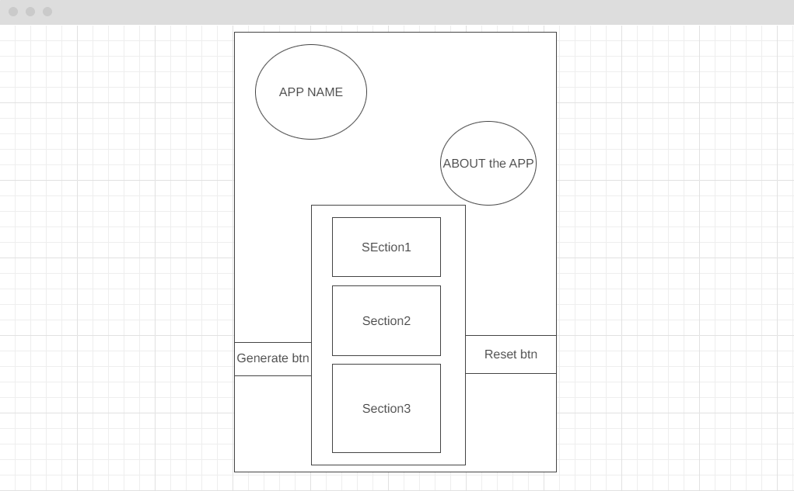
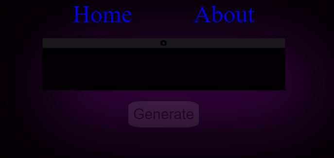

# Generate Fake User Data

---

APP is used to generate fake user data from an API

---

### Technologies Used
--- 

- HTML
- CSS
- JavaScript
- jQuery
- randomUser API

---

### Future Features

- Include a way to save/star user as favorites

### Screenshots

---

---

## Visit the Website
   [getUserData Site](https://getuserdata.netlify.app)

###### link
[Wireframe Link](https://wireframe.cc/v7b0Xf)
